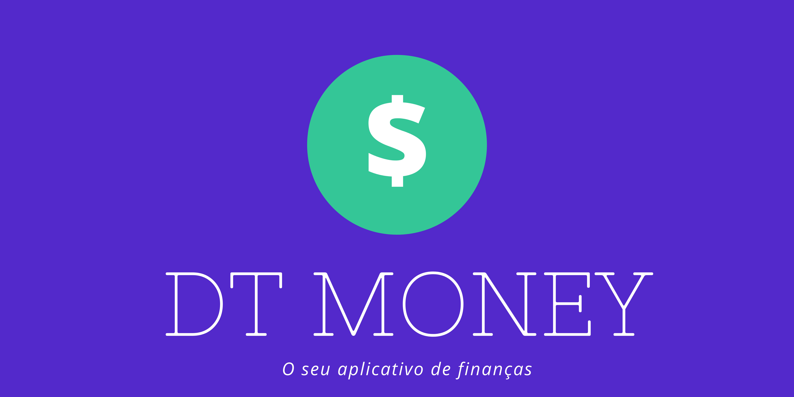
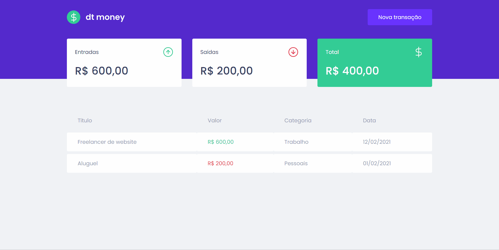

<h1 align="center">
    
</h1>


<p align="center">
  
  
  
  
</p>

<br>
  
- [Instalação](#instalacao)
- [Tecnologias](#tecnologias)
- [Contribuição](#contribuicao)
- [Autor](#autor)

<br>

DT Money é uma aplicação para gestão de entradas e saídas de recursos financeiros. Em sua tela inicial, são apresentados os valores totais, seguido por uma lista de itens.

Cada item possui um título, valor, tipo (entrada ou saída), categoria e data em que foi realizada. Essa é preenchida automaticamente pelo sistema. 

Esse projeto foi desenvolvido durante o curso ignite ReactJS da Rocketseat. Por se tratar de um treinamento para desenvolvimento do front-end, não há persistência de dados.
 
<p align="center">
  
</p>

-----
<div id="instalacao">
  
  ## Instalação
  
  ### Pré-Requisitos
  Antes de começar, você vai precisar ter instalado em sua máquina o [Git]('https://git-scm.com/downloads'), [Node v.16]('https://nodejs.org/en/') e [Yarn v.1.22]('https://classic.yarnpkg.com/lang/en/docs/install/)
  
<br>

  ### Requisitos do projeto

  ```
    # Clone o repositório
    $ git clone https://github.com/ncgc/dt_money.git

    # Vá ao repositório
    $ cd dt_money

    # Instale as dependências
    $ yarn install

    # Execute
    $ yarn start

  ```
  
</div>

<br>

<div id="tecnologias">

## Tecnologias

  
  
  
  
  
</div>

<br>

<div id="contribuicao">

## Contribução

1. Faça um **fork** do projeto.
2. Crie uma nova branch com as suas alterações: `git checkout -b my-feature`
3. Salve as alterações e crie uma mensagem de commit contando o que você fez: `git commit -m "feature: My new feature"`
4. Envie as suas alterações: `git push origin my-feature`

</div>

<br>

----
<div id="autor" align="center">
Feito com 💜 por ncgc e Rocketseat
</div>
